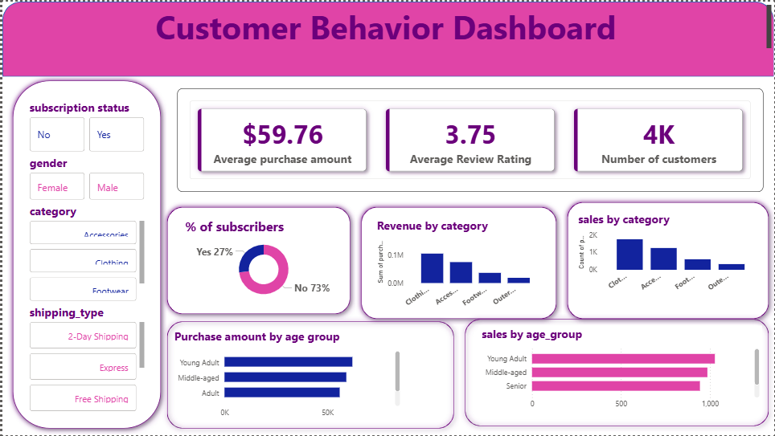

# Customer Behavior Dashboard

This repository contains a complete **Customer Behavior Analysis project** built using **Python, SQL (MySQL), and Power BI**.  
The project analyzes customer shopping patterns, purchasing behavior, and revenue drivers, and presents the insights through an interactive dashboard.

The goal of this project is to understand **who the customers are, how they shop, and what factors influence revenue and loyalty**.

---

## Dataset Information

The dataset (`customer_shopping_behavior.csv`) contains customer-level shopping data with the following key attributes:

- **Customer ID** → Unique identifier for each customer  
- **Age** → Customer age  
- **Gender** → Male / Female  
- **Item Purchased** → Product purchased by the customer  
- **Category** → Product category (Clothing, Footwear, Accessories, etc.)  
- **Purchase Amount (USD)** → Total purchase value  
- **Location** → Customer location  
- **Size / Color / Season** → Product attributes  
- **Review Rating** → Customer review rating for the product  
- **Subscription Status** → Subscriber or Non-subscriber  
- **Shipping Type** → Standard, Express, Free Shipping, etc.  
- **Discount Applied** → Whether a discount was used  
- **Previous Purchases** → Number of past purchases  
- **Frequency of Purchases** → Purchase frequency (Weekly, Monthly, etc.)

This structured data enables detailed analysis of **customer segments, revenue patterns, loyalty behavior, and product performance**.

---

## Data Preparation & Processing

The dataset was processed using **Python (Pandas)** before loading into **MySQL** and **Power BI**:

- Cleaned column names (lowercase, standardized format)
- Handled missing values in review ratings using **median imputation by category**
- Created derived features:
  - **Age Groups** (Young Adult, Adult, Middle-aged, Senior)
  - **Purchase Frequency in Days**
- Removed redundant columns after validation
- Loaded the cleaned data into a **MySQL database** for SQL analysis

---

## Dashboard Features

### Overall Customer Overview
- Total customers
- Average purchase amount
- Average review rating
- Subscriber vs Non-subscriber distribution

### Revenue Analysis
- Revenue by gender
- Revenue contribution by age group
- Revenue by product category

### Product Insights
- Top-rated products
- Most purchased products per category
- Products with highest discount usage

### Customer Segmentation
- New, Returning, and Loyal customer segments
- Repeat buyers vs subscription status

### Shipping & Discounts
- Average purchase comparison by shipping type
- Impact of discounts on high-value purchases

---

## SQL Analysis Highlights

Key business questions answered using SQL:

- Revenue comparison between **male vs female customers**
- Do **subscribed customers spend more** than non-subscribers?
- Which products have the **highest discount usage rate**?
- Identification of **high-value customers using discounts**
- Customer segmentation based on **purchase history**
- Top 3 most purchased products in each category
- Revenue contribution by **age group**

---

## Tools & Technologies Used

- **Python** (Pandas, NumPy)
- **MySQL** (Data storage & SQL analysis)
- **Power BI** (Interactive dashboard & visualization)
- **Jupyter Notebook**
- **SQLAlchemy** (Database connection)

---

## How to Use

1. Clone or download this repository.
2. Open the Jupyter Notebook to view data cleaning and feature engineering steps.
3. Import the cleaned dataset into MySQL using the provided script.
4. Open the Power BI dashboard file (`.pbix`) in **Power BI Desktop**.
5. Update the data source connection if required.
6. Refresh the dataset to load the latest data.
7. Interact with filters and visuals to explore insights.

---

## Possible Use Cases

- Understanding customer purchasing behavior
- Improving subscription and loyalty strategies
- Identifying high-value customer segments
- Optimizing discounts and promotions
- Supporting data-driven marketing and sales decisions

---

## Dashboard Preview

Sample visuals from the Customer Behavior Dashboard include:
- KPI cards for revenue and customers
- Category-wise and age-group-wise sales charts
- Subscription and discount analysis visuals

---

## License

This project is licensed under the **MIT License**.

---

*End of README*
